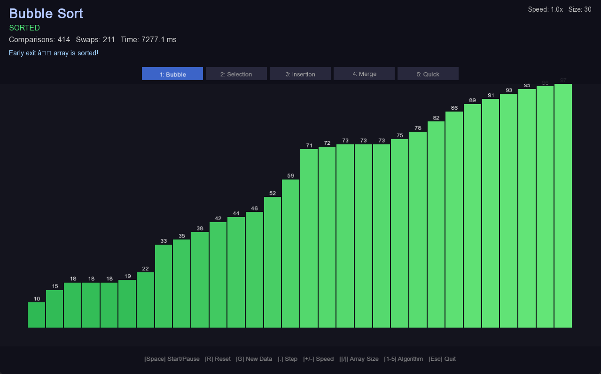
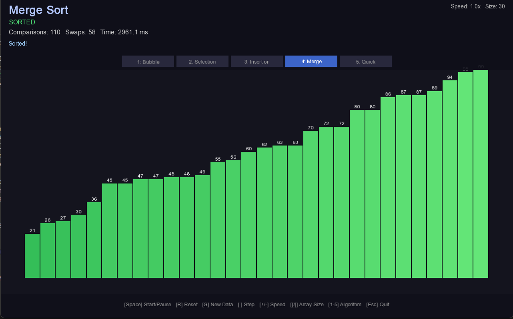
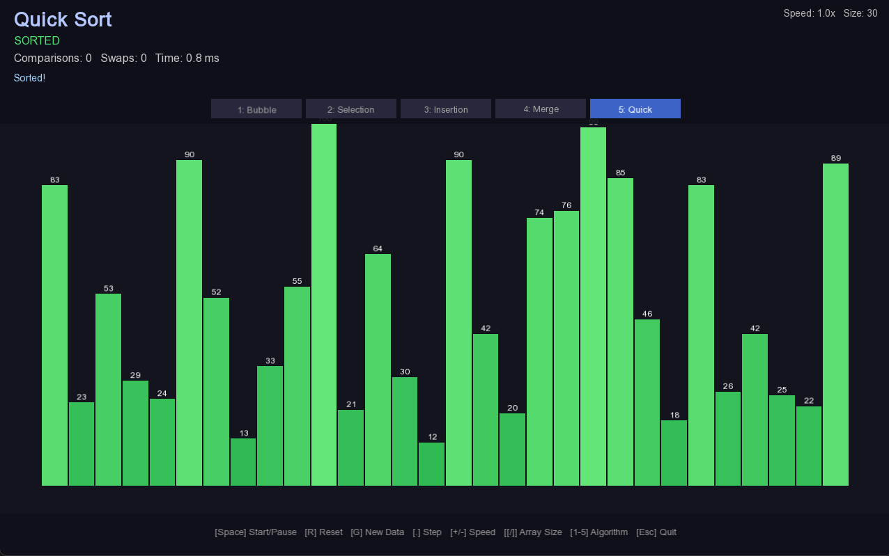
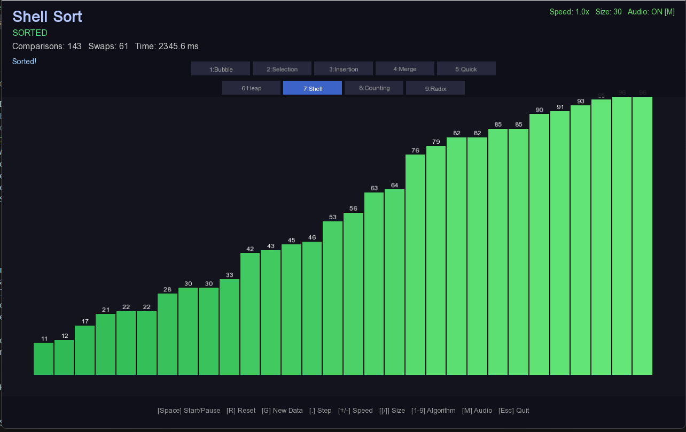
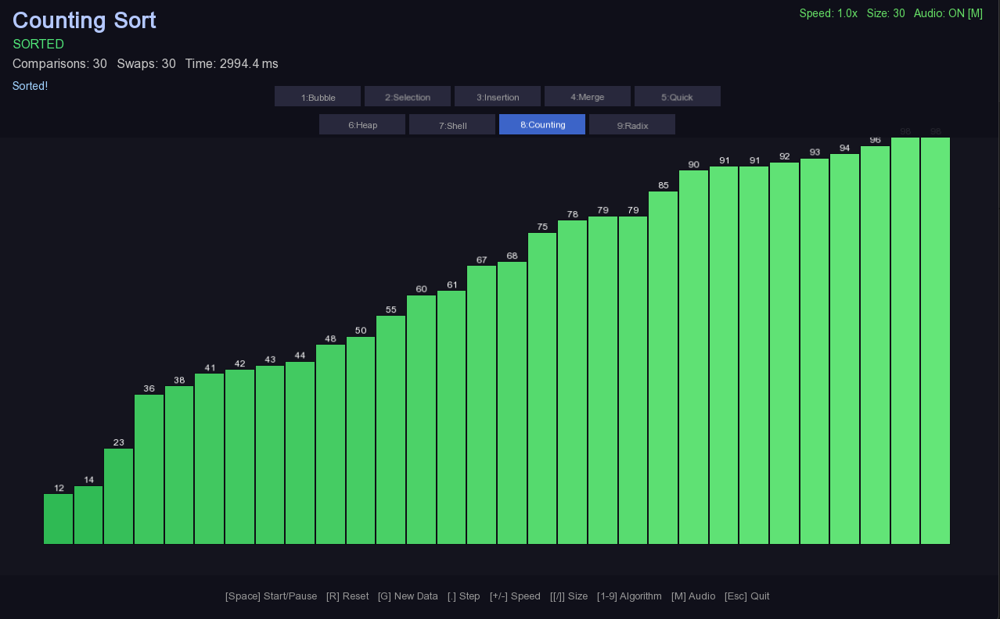
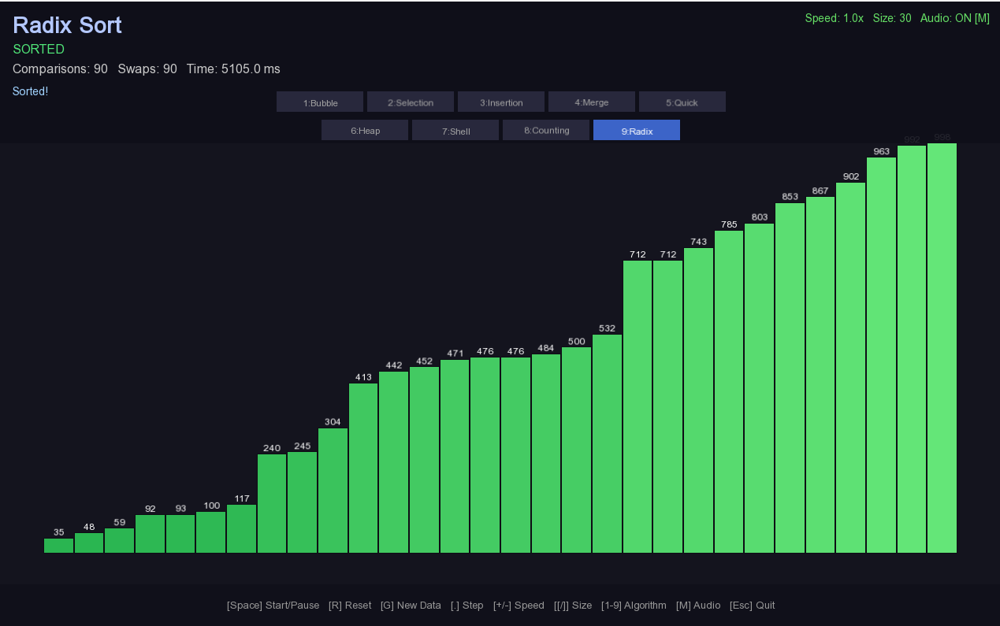

# Visual Algorithm Simulator

Visual Algorithm Simulator (VAS) merupakan perangkat lunak aplikasi desktop yang dirancang untuk memvisualisasikan proses kerja algoritma pengurutan klasik secara animasi waktu nyata (*real time*). Perangkat lunak ini dibangun menggunakan bahasa pemrograman **C++17** dan memanfaatkan pustaka grafis **SFML 3.0** sebagai fondasi antarmuka visualnya.


> 📘 **Dokumentasi Lengkap**
> Untuk panduan instalasi terperinci, penjelasan arsitektur kode, uraian setiap algoritma, prosedur penambahan algoritma baru, serta penanganan masalah (*troubleshooting*), silakan merujuk pada dokumen berikut:
>
> **[→ Baca Panduan Project Lengkap (docs/PANDUAN_PROJECT.md)](docs/PANDUAN_PROJECT.md)**
>
> | Bagian | Tautan Langsung |
> |---|---|
> | Persyaratan sistem & instalasi | [Bab 2 – Persyaratan Sistem](docs/PANDUAN_PROJECT.md#2-persyaratan-sistem) |
> | Langkah build per platform | [Bab 3 – Instalasi & Build](docs/PANDUAN_PROJECT.md#3-instalasi--build) |
> | Cara mengoperasikan aplikasi | [Bab 4 – Cara Menggunakan Aplikasi](docs/PANDUAN_PROJECT.md#4-cara-menggunakan-aplikasi) |
> | Arsitektur & design pattern | [Bab 5 – Arsitektur Kode](docs/PANDUAN_PROJECT.md#5-arsitektur-kode) |
> | Penjelasan tiap algoritma | [Bab 6 – Penjelasan Setiap Algoritma](docs/PANDUAN_PROJECT.md#6-penjelasan-setiap-algoritma) |
> | Menambahkan algoritma baru | [Bab 7 – Cara Menambah Algoritma Baru](docs/PANDUAN_PROJECT.md#7-cara-menambah-algoritma-baru) |
> | Penanganan masalah | [Bab 9 – Troubleshooting](docs/PANDUAN_PROJECT.md#9-troubleshooting) |

---

## Tangkapan Layar

### Bubble Sort


### Selection Sort


### Insertion Sort


### Merge Sort


### Quick Sort


### Heap Sort


### Shell Sort


### Counting Sort


### Radix Sort


---

## Fitur Utama

| Fitur | Keterangan |
|---|---|
| **9 Algoritma Pengurutan** | Bubble, Selection, Insertion, Merge, Quick, Heap, Shell, Counting, Radix Sort |
| **Mode langkah demi langkah** | Menghentikan sementara eksekusi dan melanjutkan satu perbandingan per interaksi |
| **Statistik waktu nyata** | Jumlah perbandingan, pertukaran, dan durasi eksekusi diperbarui setiap frame |
| **Kontrol kecepatan** | Rentang 0,1× hingga 20× kecepatan animasi |
| **Kontrol ukuran larik** | 4 hingga 100 elemen, dapat diubah saat aplikasi berjalan |
| **Kode warna batang** | Biru = default · Merah = sedang dibandingkan · Hijau = posisi final · Kuning = digeser · Oranye = heap/pivot |
| **Pemilih algoritma** | Pintasan papan ketik 1–9 atau tombol antarmuka grafis (2 baris) |
| **Audio sci-fi prosedural** | Suara dihasilkan dari PCM tanpa file aset — pitch mengikuti nilai elemen |
| **Toggle audio** | Tombol `M` untuk menyalakan/mematikan suara kapan saja |
| **Sistem pencatatan** | Empat tingkat log (Debug/Info/Warn/Error) ke konsol dan berkas `vas_log.txt` |

---

## Penjelasan Algoritma

### 1. Bubble Sort

Bubble Sort bekerja dengan cara membandingkan dua elemen yang bersebelahan secara berulang dan menukarnya apabila urutannya tidak sesuai. Implementasi VAS dilengkapi mekanisme *early exit* sehingga kompleksitas kasus terbaik menjadi O(n).

| Kompleksitas | Nilai |
|---|---|
| Kasus terbaik | O(n) |
| Kasus rata-rata | O(n²) |
| Kasus terburuk | O(n²) |
| Ruang tambahan | O(1) |

---

### 2. Selection Sort

Selection Sort mencari elemen terkecil di segmen yang belum terurut lalu menukarnya ke posisi paling kiri. Keunggulannya adalah jumlah pertukaran yang sangat minim — paling banyak n−1 swap.

| Kompleksitas | Nilai |
|---|---|
| Kasus terbaik | O(n²) |
| Kasus rata-rata | O(n²) |
| Kasus terburuk | O(n²) |
| Ruang tambahan | O(1) |

---

### 3. Insertion Sort

Insertion Sort membangun larik terurut satu elemen dalam satu waktu dengan cara menggeser elemen yang lebih besar ke kanan. Sangat efisien untuk larik yang hampir terurut.

| Kompleksitas | Nilai |
|---|---|
| Kasus terbaik | O(n) |
| Kasus rata-rata | O(n²) |
| Kasus terburuk | O(n²) |
| Ruang tambahan | O(1) |

---

### 4. Merge Sort

Merge Sort membagi larik secara rekursif lalu menggabungkannya kembali dalam urutan yang benar. Implementasi VAS menggunakan pendekatan iteratif *bottom-up* agar mendukung pause/resume.

| Kompleksitas | Nilai |
|---|---|
| Kasus terbaik | O(n log n) |
| Kasus rata-rata | O(n log n) |
| Kasus terburuk | O(n log n) |
| Ruang tambahan | O(n) |

---

### 5. Quick Sort

Quick Sort memilih pivot lalu mempartisi larik sehingga elemen lebih kecil di kiri dan lebih besar di kanan. Implementasi VAS menggunakan strategi *median-of-three* dan tumpukan eksplisit.

| Kompleksitas | Nilai |
|---|---|
| Kasus terbaik | O(n log n) |
| Kasus rata-rata | O(n log n) |
| Kasus terburuk | O(n²) |
| Ruang tambahan | O(log n) |

---

### 6. Heap Sort *(baru v2.1)*

Heap Sort membangun max-heap dari larik lalu mengekstrak elemen satu per satu dari root. Dua fase divisualisasikan secara terpisah: fase *build heap* (oranye) dan fase *ekstraksi* (merah).

| Kompleksitas | Nilai |
|---|---|
| Kasus terbaik | O(n log n) |
| Kasus rata-rata | O(n log n) |
| Kasus terburuk | O(n log n) |
| Ruang tambahan | O(1) |

---

### 7. Shell Sort *(baru v2.1)*

Shell Sort adalah generalisasi Insertion Sort yang membandingkan elemen dengan jarak (*gap*) tertentu. Implementasi VAS menggunakan gap sequence Ciura (2001) yang merupakan urutan terbaik yang diketahui secara empiris.

| Kompleksitas | Nilai |
|---|---|
| Kasus terbaik | O(n log n) |
| Kasus rata-rata | O(n log² n) |
| Kasus terburuk | O(n log² n) |
| Ruang tambahan | O(1) |

---

### 8. Counting Sort *(baru v2.1)*

Counting Sort adalah algoritma non-perbandingan yang menghitung frekuensi setiap nilai lalu merekonstruksi larik terurut. Divisualisasikan dalam 4 fase: Count → Prefix → Output → Copy Back.

| Kompleksitas | Nilai |
|---|---|
| Semua kasus | O(n + k) |
| Ruang tambahan | O(k) |

---

### 9. Radix Sort *(baru v2.1)*

Radix Sort (LSD) memproses digit dari yang paling tidak signifikan ke yang paling signifikan. Setiap digit pass menggunakan counting sort sebagai subrutin yang stabil.

| Kompleksitas | Nilai |
|---|---|
| Semua kasus | O(d · (n + k)) |
| Ruang tambahan | O(n + k) |

---

## Pintasan Papan Ketik

| Tombol | Fungsi |
|---|---|
| `Space` | Memulai / menghentikan sementara / melanjutkan animasi |
| `R` | Mengatur ulang ke data larik semula |
| `G` | Membangkitkan larik acak baru |
| `.` atau `→` | Melanjutkan tepat satu langkah (hanya saat *paused*) |
| `+` / `-` | Menaikkan / menurunkan kecepatan animasi |
| `[` / `]` | Mengurangi / menambah ukuran larik |
| `1`–`5` | Beralih ke Bubble / Selection / Insertion / Merge / Quick Sort |
| `6`–`9` | Beralih ke Heap / Shell / Counting / Radix Sort *(baru v2.1)* |
| `M` | Toggle audio on/off *(baru v2.1)* |
| `Esc` | Menutup aplikasi |

---

## Sistem Audio Sci-Fi *(baru v2.1)*

Seluruh suara dihasilkan secara prosedural dari PCM — **tidak memerlukan file audio apapun**.

| Event | Suara |
|---|---|
| Compare | Ping elektronik pendek, pitch mengikuti nilai elemen (skala pentatonik) |
| Swap | Frequency glide dari nilai A ke nilai B |
| Sorted | Arpeggio naik 5 nada: A3 → C#4 → E4 → A4 → E5 |
| New Data | Sweep 1200→300 Hz + noise burst ("initializing...") |

---

## Prosedur Build Singkat

### Prasyarat
- CMake ≥ 3.16
- Kompiler C++17 (GCC 9+, Clang 10+, atau MSVC 2019+)
- SFML 3.0 terpasang (termasuk komponen Audio)

### Windows
```powershell
cmake -B build -DCMAKE_BUILD_TYPE=Release
cmake --build build --config Release
.\build\bin\VisualAlgorithmSimulator.exe
```

### Linux / macOS
```bash
cmake -B build -DCMAKE_BUILD_TYPE=Release
cmake --build build -j4
./build/bin/VisualAlgorithmSimulator
```

---

## Kompleksitas Waktu dan Ruang

| Algoritma | Kasus Terbaik | Kasus Rata-rata | Kasus Terburuk | Ruang |
|---|---|---|---|---|
| Bubble Sort | O(n) | O(n²) | O(n²) | O(1) |
| Selection Sort | O(n²) | O(n²) | O(n²) | O(1) |
| Insertion Sort | O(n) | O(n²) | O(n²) | O(1) |
| Merge Sort | O(n log n) | O(n log n) | O(n log n) | O(n) |
| Quick Sort | O(n log n) | O(n log n) | O(n²) | O(log n) |
| Heap Sort | O(n log n) | O(n log n) | O(n log n) | O(1) |
| Shell Sort | O(n log n) | O(n log² n) | O(n log² n) | O(1) |
| Counting Sort | O(n+k) | O(n+k) | O(n+k) | O(k) |
| Radix Sort | O(d(n+k)) | O(d(n+k)) | O(d(n+k)) | O(n+k) |

---

## Ringkasan Arsitektur

```
Application
└── SortingVisualizer
    ├── AlgorithmBase (antarmuka abstrak)
    │   ├── BubbleSort       [key: 1]
    │   ├── SelectionSort    [key: 2]
    │   ├── InsertionSort    [key: 3]
    │   ├── MergeSort        [key: 4]
    │   ├── QuickSort        [key: 5]
    │   ├── HeapSort         [key: 6]  ← baru v2.1
    │   ├── ShellSort        [key: 7]  ← baru v2.1
    │   ├── CountingSort     [key: 8]  ← baru v2.1
    │   └── RadixSort        [key: 9]  ← baru v2.1
    ├── AudioManager (singleton, prosedural PCM)  ← baru v2.1
    └── Logger (singleton)
```

---

## Struktur Direktori

```
VisualAlgorithmSimulator/
├── assets/
│   └── fonts/
├── docs/
│   ├── PANDUAN_PROJECT.md
├── img/
├── include/
│   ├── algorithms/sorting/
│   ├── core/
│   └── visualizer/
├── src/
│   ├── algorithms/sorting/
│   ├── core/
│   ├── visualizer/
│   └── main.cpp
├── CMakeLists.txt
└── README.md
```

### Author
**Candra Sya'bana Putra Gunadi**