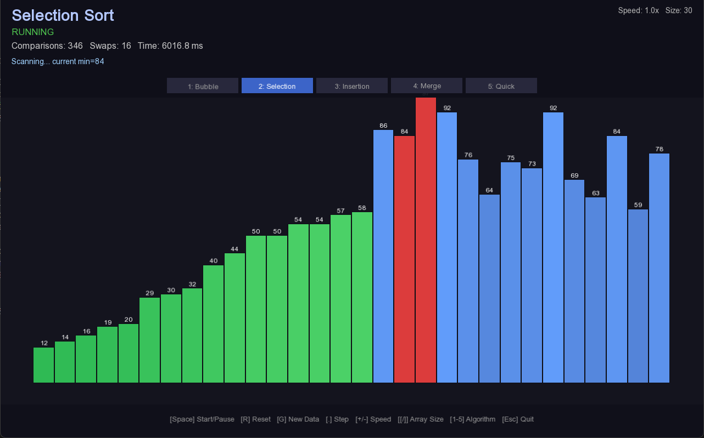
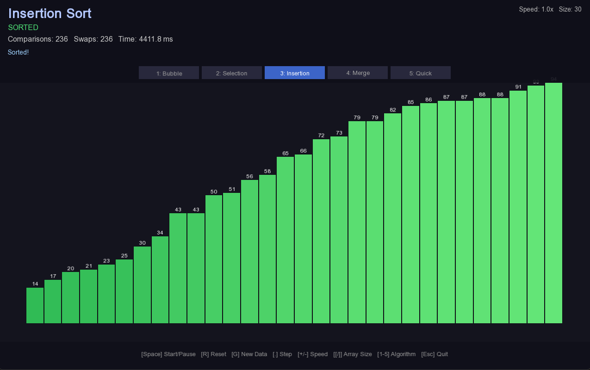

# Visual Algorithm Simulator

Visual Algorithm Simulator (VAS) merupakan perangkat lunak aplikasi desktop yang dirancang untuk memvisualisasikan proses kerja algoritma pengurutan klasik secara animasi waktu nyata (*real time*). Perangkat lunak ini dibangun menggunakan bahasa pemrograman **C++17** dan memanfaatkan pustaka grafis **SFML 3.0** sebagai fondasi antarmuka visualnya.


> 📘 **Dokumentasi Lengkap**
> Untuk panduan instalasi terperinci, penjelasan arsitektur kode, uraian setiap algoritma, prosedur penambahan algoritma baru, serta penanganan masalah (*troubleshooting*), silakan merujuk pada dokumen berikut:
>
> **[→ Baca Panduan Project Lengkap (PANDUAN_PROJECT.md)](PANDUAN_PROJECT.md)**
>
> | Bagian | Tautan Langsung |
> |---|---|
> | Persyaratan sistem & instalasi | [Bab 2 – Persyaratan Sistem](PANDUAN_PROJECT.md#2-persyaratan-sistem) |
> | Langkah build per platform | [Bab 3 – Instalasi & Build](PANDUAN_PROJECT.md#3-instalasi--build) |
> | Cara mengoperasikan aplikasi | [Bab 4 – Cara Menggunakan Aplikasi](PANDUAN_PROJECT.md#4-cara-menggunakan-aplikasi) |
> | Arsitektur & design pattern | [Bab 5 – Arsitektur Kode](PANDUAN_PROJECT.md#5-arsitektur-kode) |
> | Penjelasan tiap algoritma | [Bab 6 – Penjelasan Setiap Algoritma](PANDUAN_PROJECT.md#6-penjelasan-setiap-algoritma) |
> | Menambahkan algoritma baru | [Bab 7 – Cara Menambah Algoritma Baru](PANDUAN_PROJECT.md#7-cara-menambah-algoritma-baru) |
> | Penanganan masalah | [Bab 9 – Troubleshooting](PANDUAN_PROJECT.md#9-troubleshooting) |

---

## Tangkapan Layar

### Bubble Sort


### Selection Sort



### Insertion Sort


### Merge Sort


### Quick Sort


---

## Fitur Utama

| Fitur | Keterangan |
|---|---|
| **5 Algoritma Pengurutan** | Bubble, Selection, Insertion, Merge, Quick Sort |
| **Mode langkah demi langkah** | Menghentikan sementara eksekusi dan melanjutkan satu perbandingan per interaksi |
| **Statistik waktu nyata** | Jumlah perbandingan, pertukaran, dan durasi eksekusi diperbarui setiap frame |
| **Kontrol kecepatan** | Rentang 0,1× hingga 20× kecepatan animasi |
| **Kontrol ukuran larik** | 4 hingga 100 elemen, dapat diubah saat aplikasi berjalan |
| **Kode warna batang** | Biru = default · Merah = sedang dibandingkan · Hijau = posisi final · Kuning = sedang digeser |
| **Pemilih algoritma** | Pintasan papan ketik 1–5 atau tombol antarmuka grafis |
| **Sistem pencatatan** | Empat tingkat log (Debug/Info/Warn/Error) ke konsol dan berkas `vas_log.txt` |

---

## Penjelasan Algoritma

### 1. Bubble Sort

Bubble Sort merupakan algoritma pengurutan paling sederhana yang bekerja dengan cara membandingkan dua elemen yang bersebelahan secara berulang, kemudian menukarnya apabila urutannya tidak sesuai. Proses ini diulangi dari awal larik hingga seluruh elemen berada pada posisi yang benar. Nama "bubble" merujuk pada perilaku elemen dengan nilai terbesar yang secara bertahap "menggelembung" ke ujung kanan larik pada setiap putaran.

Implementasi pada VAS dilengkapi dengan mekanisme *early exit*: apabila satu putaran penuh tidak menghasilkan pertukaran apapun, algoritma menghentikan eksekusi lebih awal karena larik telah dalam kondisi terurut. Hal ini menjadikan kompleksitas kasus terbaik Bubble Sort sebesar O(n) pada larik yang sudah hampir terurut.

| Kompleksitas | Nilai |
|---|---|
| Kasus terbaik | O(n) |
| Kasus rata-rata | O(n²) |
| Kasus terburuk | O(n²) |
| Ruang tambahan | O(1) |

---

### 2. Selection Sort

Selection Sort bekerja dengan cara membagi larik menjadi dua bagian: segmen yang telah terurut di sisi kiri dan segmen yang belum terurut di sisi kanan. Pada setiap iterasi, algoritma mencari elemen terkecil di dalam segmen yang belum terurut, kemudian menukarnya ke posisi paling kiri dari segmen tersebut sehingga segmen terurut bertambah satu elemen.

Keunggulan utama Selection Sort terletak pada jumlah pertukaran yang sangat minim, yakni paling banyak *n*−1 pertukaran untuk larik berukuran *n*, menjadikannya pilihan yang efisien apabila operasi penulisan (*write*) ke memori memiliki biaya yang tinggi. Namun demikian, algoritma ini tidak memiliki optimasi *early exit* sehingga selalu mengeksekusi O(n²) perbandingan.

| Kompleksitas | Nilai |
|---|---|
| Kasus terbaik | O(n²) |
| Kasus rata-rata | O(n²) |
| Kasus terburuk | O(n²) |
| Ruang tambahan | O(1) |

---

### 3. Insertion Sort

Insertion Sort bekerja dengan cara membangun larik terurut secara bertahap, satu elemen dalam satu waktu. Algoritma mengambil elemen berikutnya dari segmen yang belum terurut, menggeser semua elemen yang lebih besar ke kanan untuk membuat ruang, kemudian menyisipkan elemen tersebut di posisi yang tepat. Analogi yang umum digunakan adalah cara manusia menyusun kartu remi di tangan.

Insertion Sort sangat efisien untuk larik berukuran kecil atau larik yang sudah hampir terurut, di mana kompleksitasnya mendekati O(n). Oleh karena itu, algoritma ini sering digunakan sebagai komponen dalam algoritma pengurutan hibrida seperti Timsort yang digunakan oleh Python dan Java.

| Kompleksitas | Nilai |
|---|---|
| Kasus terbaik | O(n) |
| Kasus rata-rata | O(n²) |
| Kasus terburuk | O(n²) |
| Ruang tambahan | O(1) |

---

### 4. Merge Sort

Merge Sort merupakan algoritma pengurutan berbasis paradigma *divide and conquer* yang membagi larik menjadi dua bagian secara rekursif hingga setiap bagian hanya memuat satu elemen, kemudian menggabungkan kembali (*merge*) bagian-bagian tersebut dalam urutan yang benar. Algoritma ini menjamin kompleksitas O(n log n) pada semua kasus, menjadikannya salah satu algoritma pengurutan yang paling dapat diandalkan.

Implementasi pada VAS menggunakan pendekatan iteratif *bottom-up* (bukan rekursif) agar mekanisme jeda dan lanjut (*pause/resume*) dapat diterapkan tanpa kerumitan pengelolaan tumpukan rekursi. Satu-satunya kekurangan Merge Sort adalah kebutuhan ruang tambahan sebesar O(n) untuk penyangga (*buffer*) selama proses penggabungan.

| Kompleksitas | Nilai |
|---|---|
| Kasus terbaik | O(n log n) |
| Kasus rata-rata | O(n log n) |
| Kasus terburuk | O(n log n) |
| Ruang tambahan | O(n) |

---

### 5. Quick Sort

Quick Sort merupakan algoritma pengurutan berbasis paradigma *divide and conquer* yang memilih sebuah elemen sebagai pivot, kemudian mempartisi larik sehingga semua elemen yang lebih kecil dari pivot berada di sisi kiri dan semua elemen yang lebih besar berada di sisi kanan. Proses ini diulang secara rekursif pada kedua sisi hingga seluruh larik terurut.

Quick Sort umumnya dianggap sebagai algoritma pengurutan yang paling cepat dalam praktik karena memiliki konstanta yang kecil dan lokalitas *cache* yang baik. Implementasi pada VAS menggunakan strategi pemilihan pivot *median-of-three* untuk menghindari kasus terburuk O(n²) pada data yang telah terurut, serta menerapkan pendekatan iteratif dengan tumpukan eksplisit untuk mendukung mekanisme *pause/resume*.

| Kompleksitas | Nilai |
|---|---|
| Kasus terbaik | O(n log n) |
| Kasus rata-rata | O(n log n) |
| Kasus terburuk | O(n²) |
| Ruang tambahan | O(log n) |

---

## Pintasan Papan Ketik

| Tombol | Fungsi |
|---|---|
| `Space` | Memulai / menghentikan sementara / melanjutkan animasi |
| `R` | Mengatur ulang ke data larik semula (sebelum pengurutan) |
| `G` | Membangkitkan larik acak baru |
| `.` atau `→` | Melanjutkan tepat satu langkah (hanya saat kondisi *paused*) |
| `+` / `-` | Menaikkan / menurunkan kecepatan animasi |
| `[` / `]` | Mengurangi / menambah ukuran larik |
| `1`–`5` | Beralih algoritma pengurutan |
| `Esc` | Menutup aplikasi |

---

## Prosedur Build Singkat

### Prasyarat
- CMake ≥ 3.16
- Kompiler C++17 (GCC 9+, Clang 10+, atau MSVC 2019+)
- SFML 3.0 terpasang

### Windows
```powershell
cmake -B build -DCMAKE_BUILD_TYPE=Release
cmake --build build --config Release
.\build\bin\VisualAlgorithmSimulator.exe
```

### Linux / macOS
```bash
cmake -B build -DCMAKE_BUILD_TYPE=Release -DSFML_DIR=/path/to/sfml/lib/cmake/SFML
cmake --build build -j4
./build/bin/VisualAlgorithmSimulator
```

> Untuk instruksi build yang lebih terperinci pada setiap sistem operasi, termasuk mode Debug dan penanganan kesalahan konfigurasi, lihat [Bab 3 – Instalasi & Build](PANDUAN_PROJECT.md#3-instalasi--build).

---

## Kompleksitas Waktu dan Ruang

| Algoritma | Kasus Terbaik | Kasus Rata-rata | Kasus Terburuk | Ruang |
|---|---|---|---|---|
| Bubble Sort | O(n) | O(n²) | O(n²) | O(1) |
| Selection Sort | O(n²) | O(n²) | O(n²) | O(1) |
| Insertion Sort | O(n) | O(n²) | O(n²) | O(1) |
| Merge Sort | O(n log n) | O(n log n) | O(n log n) | O(n) |
| Quick Sort | O(n log n) | O(n log n) | O(n²) | O(log n) |

---

## Ringkasan Arsitektur

```
Application
└── SortingVisualizer
    ├── AlgorithmBase (antarmuka abstrak)
    │   ├── BubbleSort
    │   ├── SelectionSort
    │   ├── InsertionSort
    │   ├── MergeSort
    │   └── QuickSort
    └── Logger (singleton)
```

Pola perancangan (*design pattern*) yang diterapkan meliputi Template Method pada `AlgorithmBase`, Observer melalui mekanisme *callback* `onStepChanged`, Factory Method pada `SortingVisualizer::createAlgorithm()`, serta Singleton pada `Logger`. Uraian lengkap tersedia pada [Bab 5 – Arsitektur Kode](PANDUAN_PROJECT.md#5-arsitektur-kode).

---

## Struktur Direktori

```
VisualAlgorithmSimulator/
├── assets/
│   └── fonts/              # Berkas font Roboto / OpenSans
├── img/                    # Tangkapan layar dan aset gambar
│   ├── bubble_sort.png
│   ├── selection_sort.png
│   ├── merge_sort.png
│   └── quick_sort.png
├── include/
│   ├── algorithms/sorting/ # Berkas header algoritma
│   ├── core/               # application.h, algorithm_base.h, logger.h
│   └── visualizer/         # sorting_visualizer.h
├── src/
│   ├── algorithms/sorting/ # Implementasi 5 algoritma pengurutan
│   ├── core/               # application.cpp, logger.cpp
│   ├── visualizer/         # sorting_visualizer.cpp
│   └── main.cpp
├── CMakeLists.txt
├── PANDUAN_PROJECT.md
└── README.md
```

---

### Author
**Candra Sya'bana Putra Gunadi**